# Hybrid Retrieval-Augmented Generation (RAG) for Factual Solution Generation on GitHub Issues Using Sentence-BERT

A hybrid Retrieval-Augmented Generation (RAG) system for retrieving relevant GitHub Issues and generating concise, issue-level summaries using semantic retrieval, CrossEncoder reranking, and FLAN-T5.

## Overview

This project implements a RAG pipeline designed to retrieve technical issues from a GitHub Issues dataset and generate responses grounded in the retrieved issue context.

The system combines:

- Sentence-BERT for semantic query encoding and dense retrieval
- FAISS for efficient vector similarity search
- CrossEncoder for candidate reranking
- FLAN-T5 for response generation
- Gradio for a simple interactive interface

The project was developed as an undergraduate thesis project.

## System Pipeline

```mermaid
flowchart LR
    A[User Query] --> B[Query Normalization]
    B --> C[Sentence-BERT]
    C --> D[FAISS Dense Retrieval]
    D --> E[Top 80 Candidates]
    E --> F[CrossEncoder Reranking]
    F --> G[Issue Selection]
    G --> H[Context Construction]
    H --> I[FLAN-T5]
    I --> J[Generated Summary]
    J --> K[GitHub Issue References]
```



## Dataset

The system uses the GitHub Issues dataset provided in the companion repository:

[github-issues-dataset](https://github.com/briyanyehezkhiel/github-issues-dataset)

The dataset contains GitHub issue information, including issue titles, bodies, answers, repository information, labels, and related metadata.

### Dataset Processing

The notebook performs the following filtering steps:

1. Load the GitHub Issues dataset from the release file.
2. Keep closed issues.
3. Filter issues using technical labels:
   - `bug`
   - `error`
   - `exception`
   - `question`
   - `technical`
   - `help wanted`
4. Extract issues that contain answers.
5. Construct retrieval documents from issue bodies and answer chunks.

Dataset sizes recorded in the notebook:

| Stage | Records |
|---|---:|
| Initial dataset | 15,955 |
| After technical-label filtering | 13,665 |
| After answer filtering | 13,055 |
| Retrieval corpus vectors | 26,077 |

## Text Preprocessing

The preprocessing pipeline includes:

- HTML cleaning with BeautifulSoup
- Code block replacement
- Text normalization
- Whitespace normalization
- Sentence-based chunking
- Chunking with a maximum of 150 words

The retrieval corpus contains both:

- `issue_body`
- `issue_answer`

Each corpus entry is associated with metadata such as issue ID, title, URL, repository, type, likes, and label.

## Dense Retrieval

The query is normalized and encoded using a trained Sentence-BERT model.

FAISS is then used to retrieve semantically similar candidates based on normalized embedding vectors.

For the final RAG pipeline, the system retrieves up to 80 candidates before reranking.

## CrossEncoder Reranking

The retrieved candidates are reranked using:

```text
cross-encoder/ms-marco-MiniLM-L-6-v2
```

The CrossEncoder evaluates query-document pairs and produces relevance scores. The highest-scoring candidates are retained for the subsequent issue-level context construction.

## Issue-Level Context Construction

Instead of directly generating an answer from individual chunks, the system groups retrieved chunks by issue.

The selected issue context can contain:

- Issue description
- Relevant discussion
- Additional answer/discussion chunks

The pipeline limits the number of selected issues and chunks to keep the generation context manageable.

The system also performs lightweight query-intent detection for categories such as:

- Infrastructure
- Network
- UI
- Mixed

This helps filter issue contexts before generation.

## Generation

The generation component uses:

```text
google/flan-t5-large
```

The selected issue context is compressed and converted into a generation prompt before being passed to FLAN-T5.

Generation uses deterministic decoding with beam search and additional controls for repetition and output length.

The generated output is cleaned before being returned to the user.

## Retrieval Evaluation

The notebook contains implementations for the following retrieval metrics:

- Accuracy@1
- MRR@10
- nDCG@5
- Recall@5
- Recall@10

Two evaluation approaches are implemented:

### Basic Retrieval Evaluation

The basic evaluation samples up to 300 dataset records and uses the issue title as the query.

### Gold Query Evaluation

A separate gold-query evaluation pipeline is implemented using manually written user-style queries associated with target issue IDs.

The notebook includes functions for calculating Accuracy@1, MRR@10, nDCG@5, and Recall@K on this gold-query set.

> Note: The current GitHub notebook retains the evaluation implementation, but the final printed metric values are not stored in the notebook outputs. Therefore, this README does not reproduce numeric evaluation scores that cannot be verified directly from the uploaded notebook.

## Interactive Interface

A Gradio interface is included for testing the RAG pipeline.

Example queries used in the notebook include:

```text
http 403 websocket issue
connection reset by peer
windows socket stack problem
```

The interface returns:

- Retrieved issue title
- Generated summary
- GitHub issue references
- Runtime

## Example Output

For the example query:

```text
web socket error
```

the notebook retrieves issues related to WebSocket and socket errors and generates issue-level summaries with references to the corresponding GitHub Issues.

## Technologies

- Python
- Pandas
- NumPy
- NLTK
- BeautifulSoup
- Sentence-Transformers
- FAISS
- CrossEncoder
- Hugging Face Transformers
- FLAN-T5
- PyTorch
- Gradio
- Google Colab

## Project Structure

```text
github-issues-rag/
├── README.md
└── RAG_GitHub_Issues.ipynb
```

The notebook contains the complete experimental and inference workflow.

For local execution, the notebook expects the trained Sentence-BERT model and retrieval artifacts to be available under:

```text
artifacts/
├── sbert_epoch_1/
├── best_faiss.index
├── corpus.pkl
└── metadata.pkl
```

These artifacts are not included in this repository.

## How to Run

### 1. Open the notebook

Open:

```text
RAG_GitHub_Issues.ipynb
```

in Google Colab or a compatible Jupyter environment.

### 2. Install dependencies

The notebook installs the main dependencies required for the pipeline, including:

```text
transformers
accelerate
sentencepiece
sentence-transformers
faiss
nltk
beautifulsoup4
gradio
```

A GPU-enabled environment is recommended for running the trained models and generation stage.

### 3. Prepare the artifacts

Place the required trained model and retrieval artifacts in:

```text
artifacts/
```

as described in the Project Structure section.

### 4. Run the notebook

Execute the cells in order to load the dataset, prepare the retrieval pipeline, perform reranking, generate summaries, and launch the Gradio interface.

## Project Context

This project was developed as an undergraduate thesis in Computer Science.

The research focuses on using Retrieval-Augmented Generation to provide factual, context-grounded solutions for technical problems represented in GitHub Issues.

The complete workflow covers:

```text
Data Filtering
    ↓
Text Preprocessing
    ↓
Corpus Construction
    ↓
Sentence-BERT Retrieval
    ↓
FAISS Search
    ↓
CrossEncoder Reranking
    ↓
Issue-Level Context Construction
    ↓
FLAN-T5 Generation
    ↓
Generated Summary + References
```

## Note

This repository contains the research notebook and supporting documentation for the RAG project.

The dataset is maintained separately in the companion repository:

[github-issues-dataset](https://github.com/briyanyehezkhiel/github-issues-dataset)
